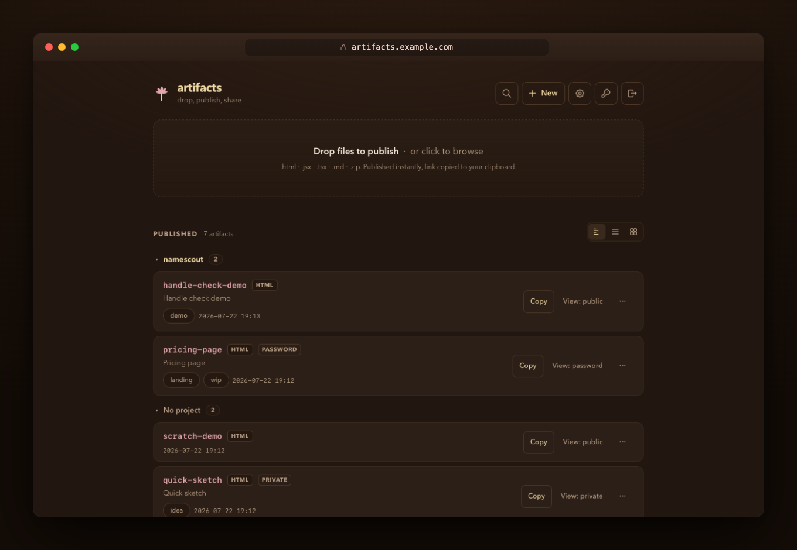

# artifacts

**Self-hosted, Claude-style artifact publishing.** POST HTML, a React component, Markdown, or a zipped static site — get back an unguessable URL on your own domain.

[](https://github.com/kuyazee/artifacts/actions/workflows/ci.yml)
[](LICENSE)
[](package.json)



AI assistants generate a lot of shareable output — dashboards, prototypes, reports, little apps. Claude's hosted artifacts are great, but the URLs live on someone else's infrastructure. This is the ~600-line self-hosted version.

## What it does

- **Four content types:** HTML, JSX/TSX (single React component, no build step), Markdown, and zipped static sites.
- **Agent-native, human-friendly:** built-in MCP server — Claude Code, Codex, or any MCP client publishes with one tool call. Humans get a drag-and-drop web UI at `/` (locked behind your API key) and a [CLI](docs/cli.md).
- **Private by default:** unguessable slugs, `noindex` everywhere, bearer-key writes, optional expiry.
- **Lifecycle controls:** custom slugs, rename, disable without deleting, auto-expire, delete.
- **Intentionally boring:** one container, no database, no accounts — artifacts are plain files under `/data`.

## 60-second quickstart

```bash
git clone https://github.com/kuyazee/artifacts && cd artifacts
ARTIFACTS_API_KEY=$(openssl rand -hex 32) BASE_URL=https://artifacts.example.com docker compose up -d
```

```bash
curl -s -X POST https://artifacts.example.com/api/artifacts \
  -H "Authorization: Bearer $ARTIFACTS_API_KEY" \
  -H "Content-Type: application/json" \
  -d '{"content": "<h1>hello</h1>", "type": "html", "slug": "hello"}'
# {"slug":"hello","url":"https://artifacts.example.com/a/hello"}
```

```bash
claude mcp add --transport http artifacts https://artifacts.example.com/mcp \
  --header "Authorization: Bearer ${ARTIFACTS_API_KEY}" --scope user
```

## Where next

| I want to… | Read |
|---|---|
| Deploy it (Docker, compose, Coolify, bare node, env vars) | [docs/deploy.md](docs/deploy.md) |
| Use the REST API (incl. zip sites) | [docs/api.md](docs/api.md) |
| Publish from the terminal | [docs/cli.md](docs/cli.md) |
| Hook up Claude Code / Codex / any agent | [docs/mcp.md](docs/mcp.md) |
| Understand JSX/TSX rendering + zip validation | [docs/formats.md](docs/formats.md) |

## Security in three lines

Uploaded HTML executes — that's the product — so host it on a dedicated subdomain that never sets cookies. Writes are bearer-header-only; hosted JS can't CSRF them. Reads are public but gated by unguessable, non-indexed slugs — don't publish secrets. Full model in [SECURITY.md](SECURITY.md).

## Contributing & license

PRs welcome — see [CONTRIBUTING.md](CONTRIBUTING.md). The whole test suite is one shell script. [MIT](LICENSE) © 2026 Zonily Jame.
