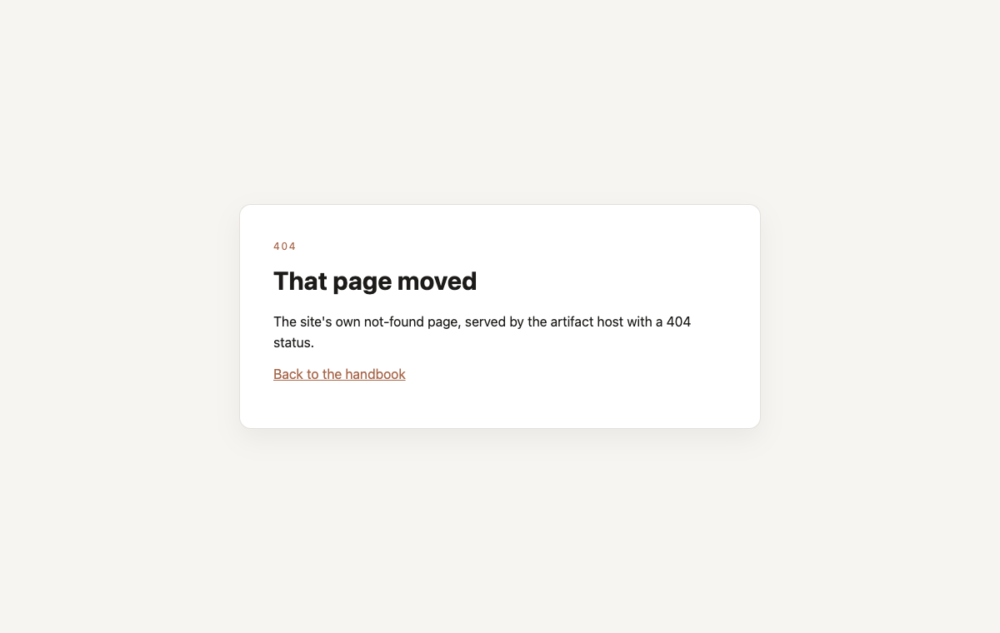
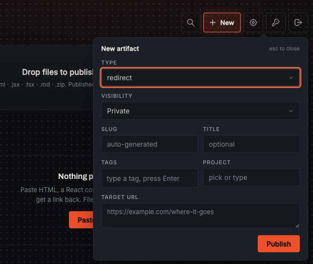
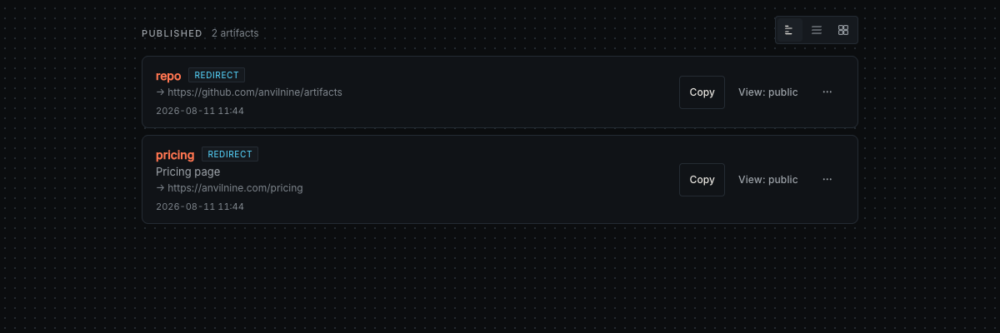

# Content formats

How each artifact type is rendered. ([← back to README](../README.md))

## HTML

Served as-is on its own page. No processing.

## Markdown

Rendered server-side (via marked) into a styled page. The original source stays available at `/a/:slug/source`. Markdown renders from its source on every view, so the settings below apply to existing artifacts the next time they load, with no re-publish.

### Markdown render settings

Four global knobs, set in the dashboard Settings popover or with `PUT /api/config`. The `MD_FONT`,
`MD_WIDTH`, `MD_SIZE` and `MD_THEME` env vars supply the starting values until something is saved:

- `md.font`: `system`, `serif`, or `mono`.
- `md.width`: `narrow` (640px), `normal` (760px), or `wide` (900px).
- `md.size`: `small`, `normal`, or `large` base font size.
- `md.theme`: `auto` (follow the reader's OS), `light`, or `dark` as the starting theme.

Example:

```bash
curl -s -X PUT https://artifacts.example.com/api/config \
  -H "Authorization: Bearer $ARTIFACTS_API_KEY" \
  -H "Content-Type: application/json" \
  -d '{"md":{"font":"serif","width":"wide","size":"large","theme":"auto"}}'
```

A bad value on any key returns 400; absent keys keep their current value.

When the viewer frame is on, a Markdown artifact gets a navbar button that cycles Auto, Light, and Dark. The choice is saved in that reader's browser and overrides `md.theme` for them only. With the frame off there is no button, and the artifact uses `md.theme` (and the reader's OS when that is `auto`).

## JSX/TSX artifacts

Upload a single React component with a **default export**. Imports of `react`, `react-dom`, `recharts`, `lucide-react` are pinned; any other package import resolves via `https://esm.sh/<pkg>?external=react,react-dom` automatically. Tailwind classes work out of the box.

```jsx
import { useState } from 'react';
import { Rocket } from 'lucide-react';

export default function Demo() {
  const [n, setN] = useState(0);
  return (
    <button className="m-8 px-4 py-2 rounded bg-blue-600 text-white" onClick={() => setN(n + 1)}>
      <Rocket className="inline w-4 h-4 mr-2" />clicked {n}
    </button>
  );
}
```

Note: rendering uses esm.sh + Tailwind CDN, so artifacts need internet to render and take ~1–3 s on first load.

## PDF

Upload a PDF and it gets a viewer page of its own at `/a/{slug}`, plus two direct links to the
file. The bytes go up base64-encoded in the same `content` field every other type uses:

```bash
curl -s -X POST https://artifacts.example.com/api/artifacts \
  -H "Authorization: Bearer $ARTIFACTS_API_KEY" -H 'Content-Type: application/json' \
  -d "{\"type\":\"pdf\",\"slug\":\"q3-report\",\"content\":\"$(base64 < q3.pdf | tr -d '\n')\"}"
```

The CLI infers the type from the extension, so `artifacts publish q3.pdf` does the same thing, and
the dashboard takes a dropped `.pdf` or a file picked from the New artifact form.

Three URLs per artifact:

| URL | What it serves |
|---|---|
| `/a/{slug}` | the viewer page (framed like every other type; `?raw=1` for the bare one) |
| `/a/{slug}/file.pdf` | the PDF itself, `application/pdf`, rendered inline |
| `/a/{slug}/file.pdf?download=1` | the same bytes with `Content-Disposition: attachment` |

`GET /a/{slug}/source` also hands over the file, as an attachment, the way `/source` returns the
uploaded bytes for every other type. Nothing else under the slug resolves: any other sub-path is a
404.

`?download=` takes a truthy value. `?download=1` and `?download=yes` attach; `?download=0`,
`?download=false` and a bare `?download=` render inline like no parameter at all.

Rules:

- The type check is two markers, both at publish time, both a 400. The decoded body has to start
  with the 5 bytes `%PDF-`, and it has to carry `%%EOF` somewhere in its last 1 KB, which is what
  catches a truncated upload: base64 cut short still decodes and still starts with `%PDF-`. Past
  those two the file is taken as given. Nothing here parses the document, so a PDF that is corrupt
  in the middle, encrypted, or built by something that writes broken xref tables publishes fine and
  is the caller's problem.
- Max 7 MB per PDF, measured on the decoded bytes. The publish body parser stops at 10 MB of JSON
  and base64 costs 4 bytes for every 3, so 7 MB of PDF is about 9.33 MB of request. Above roughly
  7.5 MB decoded the body parser answers first, with its own `body too large` message that names
  neither PDFs nor the cap; the dashboard checks the size before it uploads for that reason.
- A `PUT` of a PDF has to name `type` (`"pdf"` to send new bytes, another type to convert it).
  Omitting `type` on any other artifact rewrites it as html; on a PDF that would delete bytes
  nothing can rebuild, so it is refused instead. `PUT` with no `pdf` field keeps the stored viewer
  settings; `{"pdf": null}` clears them.
- A `data:application/pdf;base64,` prefix and the line breaks `base64` writes are both accepted, so
  a browser's `FileReader.readAsDataURL` output goes straight in.
- Everything else works the same as any other type: rename, tags, project, expiry, visibility,
  disable, duplicate, QR codes, link previews.

### The viewer, and what it does not do

The viewer page is a thin shell: a toolbar with Open and Download, and an `<object>` that points at
`/a/{slug}/file.pdf`. The rendering is the browser's own PDF viewer, which is where the page
controls come from (page navigation, zoom, rotate, print, save).

This is a deliberate v1. Bundling [pdf.js](https://mozilla.github.io/pdf.js/) would mean vendoring
about 1.7 MB of minified JavaScript into a repo with no build step, plus a hand-written toolbar to
replace the one the browser already ships. The tradeoff is that the toolbar looks different in
Chrome, Firefox and Safari, and that a browser with no built-in PDF viewer shows nothing.

For that last case the `<object>` carries fallback content: a line of text and the same Open and
Download links. A browser that refuses `application/pdf` outright shows it on its own. A browser
that accepts the type, takes the space and then paints nothing never reaches the children, so the
shell also watches for that: if the `<object>` has not fired its load event 1.5 seconds after the
page finishes loading, the script moves the fallback out of the object and drops the object. That
covers the blank-frame case measured in headless WebKit, and the one Chrome on Android has shown
historically. Which browsers land where is not something this repo has measured across the field,
so treat the fallback as the safety net rather than a list.

### Viewer controls

Two per-artifact settings, both on the `pdf` field of `POST` / `PUT` / `PATCH`, in the dashboard
row menu ("PDF view…" and "PDF download…"), and on the CLI (`artifacts pdf <slug> <setting>`):

- **`mode`**: `standard` (the default), `presentation`, or `minimal`.
- **`download`**: `true` (the default) or `false`.

```bash
curl -s -X PATCH https://artifacts.example.com/api/artifacts/q3-report \
  -H "Authorization: Bearer $ARTIFACTS_API_KEY" -H 'Content-Type: application/json' \
  -d '{"pdf":{"mode":"presentation","download":false}}'
```

A patch naming one key leaves the other alone. `{"pdf": null}` hands the artifact back to both
defaults, the way `{"frame": null}` does. A value the server does not understand, and an unknown
key, are both a `400` rather than a silent drop. So is `pdf` on an artifact that is not a pdf:
there is no viewer page for it to apply to.

The three modes:

| Mode | The page |
|---|---|
| `standard` | Our toolbar (title, Open, Download) above the document, browser controls untouched. Inside the viewer frame this toolbar is dropped: see below. |
| `presentation` | A whole page at a time on a dark backdrop, with a Full screen button in the toolbar. The browser's side panel is asked to go; its toolbar stays, because that toolbar is the page counter and the prev/next of a multi-page deck. Chrome hides it in full screen, which is where a deck is read. |
| `minimal` | The document, edge to edge. No toolbar of ours; the browser's is left alone, because with ours gone it is the only way left to reach the file. |

Which of them hides the browser's own controls comes down to `download: false`, which asks in
every mode (the next section covers that half). `presentation` asks only for the side panel to go.
So `standard` with downloads off is the document alone, and `minimal` with downloads on still has
the browser's toolbar over it.

**Presentation with downloads off has no page navigation.** Hiding the file works by asking the
browser's toolbar to go, and that toolbar is also the page counter and the prev/next. There is no
way to keep one and not the other: an `<object>` holding a PDF exposes no current page to the
page around it, and reassigning its `data` to jump to `#page=N` blanks the viewer in Chromium
rather than moving it. A reader in that combination still moves with the arrow keys and the
scroll wheel. If page navigation matters more than the buttons, leave `download` on.

A bar of ours with nothing in it is never drawn. `standard` with downloads off has no buttons left,
and inside the viewer frame the title is already in the frame's own bar, so the mode renders the
document with no bar rather than an empty strip.

**Inside the viewer frame, `standard` drops our toolbar entirely.** Framed, a PDF used to arrive
under three stacked bars: the frame's own (44px), ours (44px) and the browser's PDF toolbar
(56px), about 144px at 1200px wide before the document started. Ours was the one earning least.
Its title is already blank there, because the frame's bar above says the same words, so what was
left was Open and Download over a browser toolbar that already carries download and print. It now
goes, and the framed view is two bars, about 100px.

Nothing is taken away. Unframed (`?raw=1`, or the frame off) our bar is the only one there is and
it renders in full. `presentation` keeps its bar framed or not, because the Full screen button
lives nowhere else. `minimal` never had one. And a browser that refuses to render the PDF still
gets Open and Download from the fallback in the middle of the page.

An artifact with both defaults stores nothing at all, so `GET /api/artifacts` shows a `pdf` field
only on an artifact somebody configured.

### What "disable download" actually does

**It is not protection.** With `download: false` the viewer page drops its Open and Download
buttons and the embedded file's URL asks the browser to hide its own toolbar. That is the whole
mechanism, and it stops a reader who clicks. It stops nobody else:

- `https://artifacts.example.com/a/{slug}/file.pdf` still answers with the bytes, and so does
  `/a/{slug}/source`. Both are in the page source of the viewer, and the viewer is the only reason
  the reader had a URL to begin with.
- The `#toolbar=0` hint is an old Acrobat open parameter. Chrome's built-in viewer reads it;
  Firefox and Safari ignore it, so their own toolbars, download button and print button included,
  are still there.
- Any browser can print or save a page it has rendered.

Use it to keep a viewer on the page rather than in a downloads folder. Do not use it on a document
that would hurt you if a reader kept a copy: if the reader can see it, the reader has it. The
protection that does exist here is [visibility](api.md#visibility), which decides who reaches the
artifact at all.

## Zip sites

A zipped static project (HTML + CSS + JS + images) served under `/a/{slug}/`. Upload via the web UI (drop a `.zip`), the [CLI](cli.md) (`artifacts deploy ./dir`), or the [zip endpoint](api.md#zip-sites-multi-file-static-projects) — validation rules and limits are documented there.

### Custom not-found page

Put a `404.html` at the root of the zip and any miss under `/a/{slug}/` serves it with a 404
status: a missing file, a missing directory, a directory with no `index.html`. Without one, a miss is the branded 404
card for a browser navigation and a plain-text `not found` for an asset read or a script. The page is served the same way as the rest of the site, so relative
asset URLs inside it resolve against `/a/{slug}/`. Most static site generators already emit a
`404.html`, so this needs no extra work for an Astro or Eleventy build.



Two things it does not change. A locked artifact (private, or password with no unlock cookie)
still returns the standard artifact-not-found page for every path, so `404.html` never becomes a
way to tell a private site apart from one that does not exist. And a request for `/a/{slug}/404.html`
itself is an ordinary file read: 200, not 404.

### Static framework builds (Astro, Vite, etc.)

Output from static site generators drops straight into the zip endpoint — an Astro `astro build` (or Vite/Eleventy/etc.) `dist/` folder is just HTML + CSS + JS. The one thing to watch: because sites are served under the `/a/{slug}/` **subpath**, a build that emits **root-absolute** asset URLs (`/_astro/app.css`, `/assets/index.js`) will 404 — those resolve to the domain root, not the artifact. Build with the framework's base/subpath option set to `/a/{slug}/`:

- **Astro** — `base: '/a/{slug}/'` in `astro.config.mjs`
- **Vite** — `base: '/a/{slug}/'` in `vite.config.js`
- **Next.js** (`next export`) — `basePath` + `assetPrefix` of `/a/{slug}/`

The slug you build for must match the slug you deploy to. See [`examples/astro-demo`](../examples/astro-demo) for a working Astro project.

### Flutter web (SPA)

A `flutter build web` output hosts as a zip site, but Flutter needs a bit more than a base path
because its engine pulls resources from Google CDNs by default. Build it **self-contained**:

- **Base href** — `flutter build web --base-href /a/{slug}/` (same subpath rule as above).
- **Local engine** — add `--no-web-resources-cdn` so CanvasKit/skwasm is served from the artifact
  rather than `gstatic.com` (which the artifact [CSP](../SECURITY.md) blocks).
- **Bundled font** — bundle a text font and set it as the app's default `fontFamily`, so the engine
  doesn't fetch its Roboto fallback from Google Fonts.

Use Flutter's default **hash** routing (`/#/…`); deep links then need no server-side SPA fallback.

The zip validator accepts Flutter's build artifacts (`AssetManifest.bin`, `NOTICES`, `*.frag`
shaders, `*.js.symbols`, the local `canvaskit/` wasm). See [`examples/flutter-demo`](../examples/flutter-demo)
for a working, fully self-contained Flutter web app.

> **Full-screen apps and the viewer frame:** by default artifacts render inside the viewer frame
> (below). A full-page app like Flutter runs fine inside the frame's iframe, but if you want it
> edge-to-edge, append `?raw=1` to the URL or turn the frame off for that artifact
> (`artifacts frame <slug> off`).

## Redirects

`type: "redirect"` turns a slug into a short link. The content is the target URL, and a visit answers a real HTTP 301 with the target in `Location`. Nothing is rendered, so there is no page to view and no JavaScript bounce.

```bash
curl -X POST https://artifacts.example.com/api/artifacts \
  -H "Authorization: Bearer $ARTIFACTS_API_KEY" -H 'Content-Type: application/json' \
  -d '{"type":"redirect","content":"https://example.com/pricing","slug":"pricing"}'
```

The dashboard publishes one too: pick `redirect` in the New artifact form and the content box
becomes a single Target URL field. The Frame control disappears too, because a redirect answers
with a `Location` header and never reaches the viewer frame.



Rules:

- The target must be an absolute `http://` or `https://` URL. Anything else is a 400 at publish time, so a `javascript:` or `data:` target can never reach a viewer's browser.
- The target cannot point back at the slug being published. That link answers its own 301, so a visitor's browser hops until it gives up on an error page, and only the publisher can fix it. Refused on `POST`, on a `PUT` that repoints the slug, on a `POST /api/artifacts/:slug/duplicate` that copies a hop onto the slug it points at, and on a `PATCH` that renames a redirect onto the slug it already targets. "Points back" means this server's own `/a/<slug>` on the `BASE_URL` host, either scheme, either case, with or without a trailing slash, a trailing dot on the host, or a query.

  This check catches the typo, not the attacker. It only fires when the target spells the server the way `BASE_URL` spells it, so a deploy that never set `BASE_URL` is comparing against the default `http://localhost:<port>` and no real target ever matches: the check is off. Any other name or IP that reaches the same server walks past it, and so do two artifacts pointing at each other and a target on another host that redirects back here (both need a lookup a single publish does not have). Anyone who wants a loop can still publish one. Someone who pasted the wrong URL gets told.
- The target cannot carry a username or password. A redirect is a public hop: the credentials would show in the dashboard row, come back from the list API to every `read` key, and reach the target host from anyone who follows the link. A target already stored with credentials keeps redirecting, so an upgrade takes nothing off the air.
- The stored target is the normalized URL, not the bytes you sent: surrounding whitespace goes, the scheme and host lowercase, and everything else percent-encodes. The 2048-character cap is measured on that normalized value.
- The response carries `Cache-Control: no-store`. A browser would otherwise pin a 301 for good and strand returning visitors on the old target, so `no-store` is what makes repointing the slug with a `PUT` take effect on the next visit.
- Repointing a redirect with a `PUT` has to carry `type: "redirect"`. A `PUT` that leaves `type` out rewrites the slug as an html page holding the target URL as its body, and the redirect stops answering 301. The CLI sends the type for you when you name it (`artifacts update pricing new-target.txt --type redirect`); the row menu's Edit target action sends it too.
- Redirects skip the viewer frame, and `?raw=1` does not change that. `GET /a/:slug/source` returns the stored target as plain text.
- The 301 carries `Referrer-Policy: no-referrer`, so the target never learns which slug sent the visitor. That also keeps a `?k=` capability token out of the referrer on the hop.
- Visibility works the same as every other type. A private redirect with no capability link answers 404 on every path and never sends `Location`.
- Search engines do not follow these. Every response from the server carries `X-Robots-Tag: noindex, nofollow`, which is the same rule that keeps artifacts out of search results.

Each redirect row in the list shows where it points, under the slug, and the row's menu has an
Edit target action that repoints the slug. The target is carried in the list payload as `target`,
alongside `type` and `slug`.

`meta.json` is what the 301 follows. The target is stored twice, in `meta.target` and in the
artifact's `source.url` body, written by the same call as two separate writes; `meta.json` goes last
and is the commit marker, so letting it decide keeps the row and the `Location` header from
disagreeing after two concurrent writes to one slug. A redirect published before `meta.target`
existed falls back to its `source.url` and shows no target in the row until its next `PUT`.



### What a redirect artifact costs you

Publishing one turns your domain into an open redirector for that slug. Anyone who can reach the slug goes wherever the target points, and only a key holder can set the target, but two consequences follow:

- Your domain stops being safe to put in anyone's URL allowlist. OAuth `redirect_uri` prefix checks, SSO return-URL filters, and mail or proxy link filters that trust the whole domain can all be walked through a redirect artifact.
- A phishing link can wear your domain. The slug is unguessable, so the link has to leak or be handed out first, but once it is out it looks like you.

The server never fetches the target. A target on `localhost`, a private range, or `169.254.169.254` only reaches whoever clicks the link, so there is no server-side request forgery here.

`GET /api/keys` carries a `redirects` count per managed key, so you can see how many hops each key has minted and spot one that has started doing something it was not made for. The count is of stored redirects: a delete takes one off it, a `PUT` that repoints a slug is the same hop rather than a new one, and a duplicate is a new hop billed to the key that made the copy. Disabled and expired redirects still count, because the record is still there and is one `PATCH` away from serving again. Redirects published with the bootstrap `ARTIFACTS_API_KEY` or from a dashboard session are in nobody's count, because neither names a key, and a `PUT` from either one leaves the original key's name on the record rather than clearing it. Nothing is capped: a cap changes what an existing key is allowed to do, which is your call to make, and the count is what tells you to make it.

## Link previews

Two optional fields decide what a chat app shows when someone pastes an artifact link:
`description` (one line, max 300 chars) and `ogImage` (an absolute `http(s)` URL, another
artifact's URL included). Set them on `POST` / `PUT` / `PATCH`, on the zip endpoint's query
string, from the row menu in the dashboard ("Description…" and "Preview image…"), or with the
`description` and `ogImage` arguments on the `publish_artifact` and `update_artifact` MCP tools.

The tags land in the three pages the server builds per request:

- The **viewer frame**, which is what a top-level visit to `/a/<slug>` gets while frames are on.
  This covers every type, html included.
- The **markdown render**, so an md artifact carries them with the frame off too.
- The **pdf viewer page**, which is what `/a/<slug>` serves for a pdf whether or not the frame is
  on, so a pdf carries them with the frame off too.

They do not land anywhere else, and that is deliberate. An `html` artifact is served as-is, and a
`jsx` artifact's page is baked at publish time, so writing tags into either means editing bytes the
author wrote and re-editing them on the next metadata change. `?raw=1` on an html, jsx or zip
artifact returns what was uploaded, tags included in neither. An md artifact is the exception: it
renders through the same shell either way, so `?raw=1` carries the tags too. What always returns the
bytes as uploaded is `GET /a/:slug/source`.

Two consequences worth knowing before you set the fields:

- **An html, jsx, tsx or zip artifact needs the frame.** With `frame:false` on the artifact, or
  `FRAME_ENABLED=false` on the server, nothing wraps those types and no preview tag renders
  anywhere. The fields still store and still list. md and pdf carry them with no frame; those
  four do not.

  Rather than splice tags into a document its author wrote, every surface that sets a preview
  says when it will not show. The dashboard's "Description…" and "Preview image…" dialogs read
  the artifact's own frame setting and the global pair, and say the frame is off for this one
  when it is. `artifacts preview`, `artifacts publish` and `artifacts deploy` print a
  `warning:` line to stderr after setting a preview that nothing will render. The API and the
  MCP tools still accept the fields and still report them as set.
- **A redirect stores them and renders nothing**, because it answers `301` with no page at all.
  Same shape as the `frame` field on a redirect, which is also stored and never used. The dashboard
  hides both items on a redirect row; the API and the MCP tools take them without complaint.

Rendered per request, so an edit shows up on the next view with nothing to rebuild. What gets
written:

```html
<meta name="description" content="...">          <!-- only with a description -->
<meta property="og:title" content="...">          <!-- the title, or the slug -->
<meta property="og:url" content="...">            <!-- the permanent /a/<slug> link -->
<meta property="og:type" content="website">
<meta property="og:description" content="...">    <!-- only with a description -->
<meta property="og:image" content="...">          <!-- only with an image -->
<meta name="twitter:card" content="summary">      <!-- summary_large_image with an image -->
```

`og:url` is the permanent link, never a `?k=` capability link: an unfurl outlives the message it
appeared in, and a capability token expires and can be revoked. A locked artifact leaks nothing
either way, because the visibility gate runs before any page is built, so an unfurler holding no
token gets the same `404` a stranger gets.

None of this makes an artifact searchable. Every response still carries
`X-Robots-Tag: noindex, nofollow`, and both shells still carry `<meta name="robots" content="noindex, nofollow">`.
The fields are for the preview card in a chat window, not for a search result.

## Viewer frame

Every type above except redirects can render inside a slim top **frame** — a toolbar with the title, a copy-link button, and a hide toggle — with the artifact itself isolated in an iframe. Toggle it globally from the web UI's **Settings** panel (or `artifacts config`), and override it per artifact (`artifacts frame <slug> on|off|default`). Append `?raw=1` to any URL to view the artifact with no frame. Full behavior in [docs/api.md](api.md#viewer-frame).
